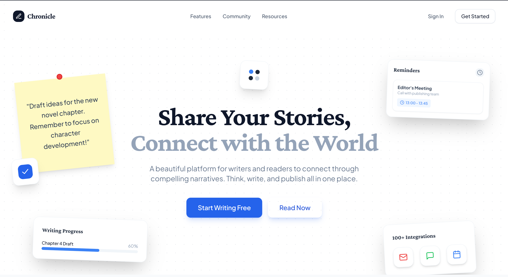
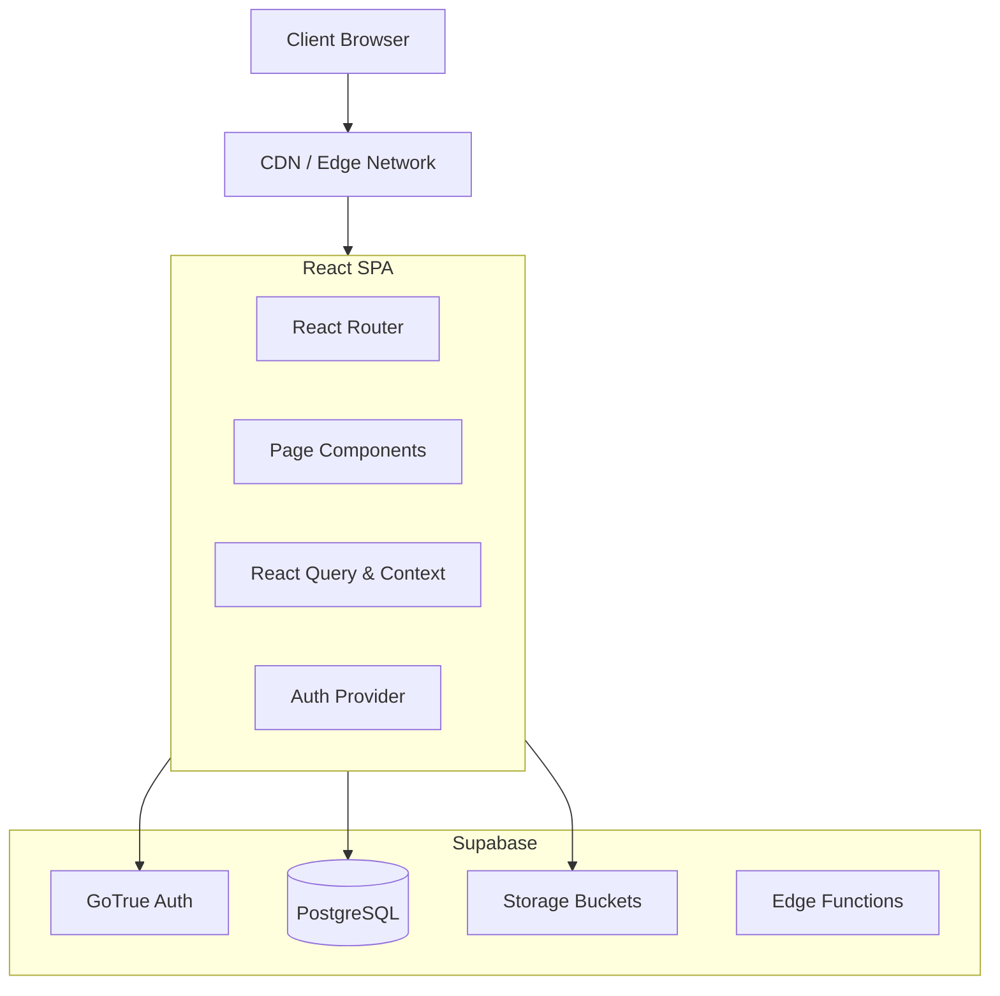
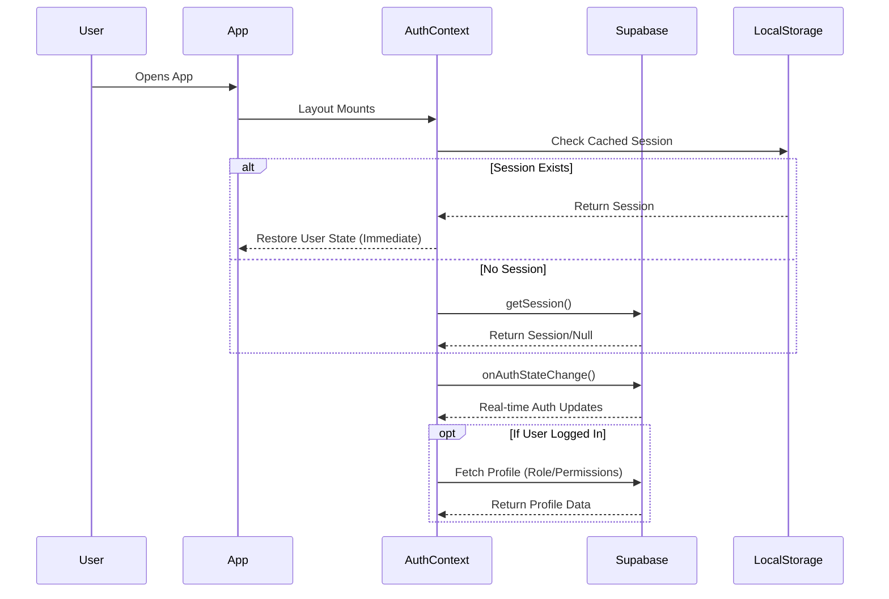
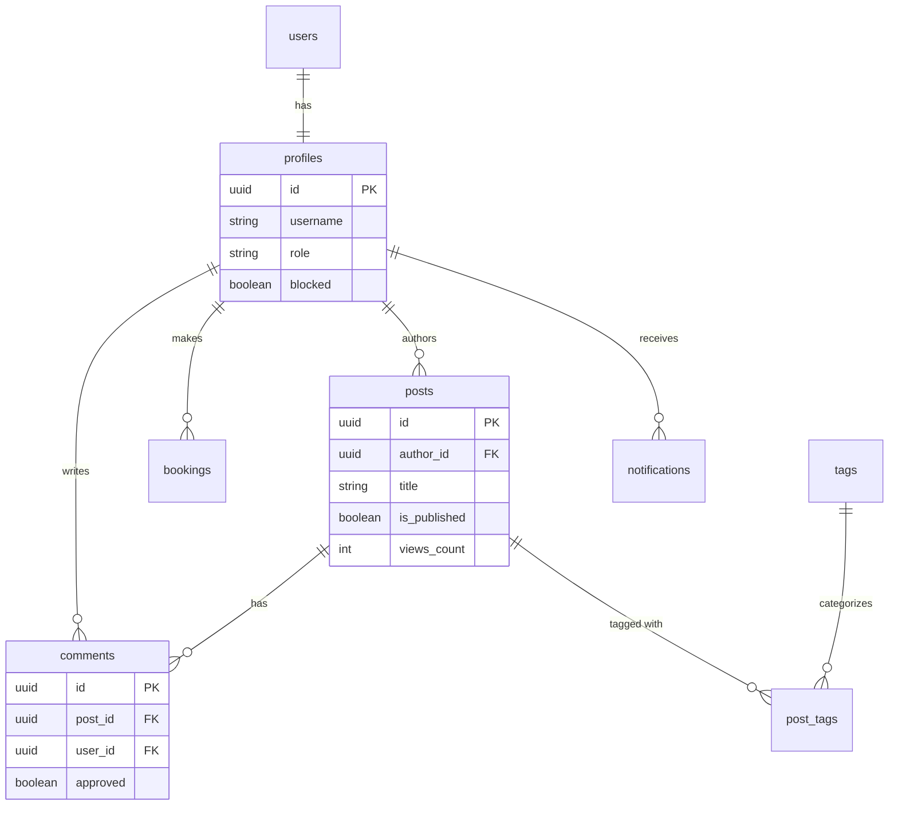

# Dev Write



**Dev Write** is a modern, full-featured blogging and content creation platform built for developers and writers who demand a premium user experience. It combines a powerful rich-text editor with a robust content management system, social features, and a secure role-based access control system.

Built with performance, scalability, and developer experience in mind, Dev Write leverages the latest web technologies including React 18, Vite, Supabase, and Tailwind CSS.

---

## 📚 Table of Contents

- [Dev Write](#dev-write)
  - [📚 Table of Contents](#-table-of-contents)
  - [🚀 Key Features](#-key-features)
    - [✍️ Writing Experience](#️-writing-experience)
    - [👥 Social & Community](#-social--community)
    - [🛡️ Security & Access Control](#️-security--access-control)
    - [⚡ Performance & SEO](#-performance--seo)
  - [🏗️ Architecture](#️-architecture)
    - [High-Level Overview](#high-level-overview)
    - [Authentication Flow](#authentication-flow)
  - [🛠️ Tech Stack](#️-tech-stack)
    - [Frontend Core](#frontend-core)
    - [State Management & Data](#state-management--data)
    - [Styling & UI](#styling--ui)
    - [Backend & Infrastructure](#backend--infrastructure)
    - [Development Tools](#development-tools)
  - [🗄️ Database Schema](#️-database-schema)
    - [Core Tables](#core-tables)
    - [Entity Relationship Diagram](#entity-relationship-diagram)
    - [Row Level Security (RLS)](#row-level-security-rls)
  - [🔐 Role-Based Access Control (RBAC)](#-role-based-access-control-rbac)
    - [Roles](#roles)
    - [Permissions](#permissions)
    - [Implementation Details](#implementation-details)
  - [🧩 Component System](#-component-system)
    - [Design System](#design-system)
    - [Core Components](#core-components)
  - [📦 Installation & Setup](#-installation--setup)
    - [Prerequisites](#prerequisites)
    - [Step-by-Step Installation](#step-by-step-installation)
    - [Environment Variables](#environment-variables)
  - [📜 Available Scripts](#-available-scripts)
  - [🚀 Deployment](#-deployment)
    - [Deploy to Vercel](#deploy-to-vercel)
    - [Deploy to Netlify](#deploy-to-netlify)
  - [📂 Project Structure](#-project-structure)
  - [🤝 Contributing](#-contributing)
  - [📄 License](#-license)

---

## 🚀 Key Features

### ✍️ Writing Experience
At the heart of Dev Write is a sophisticated writing engine designed to get out of your way while providing powerful tools when you need them.

-   **Rich Text Editor**: Powered by **Tiptap**, offering a Notion-style block-based editing experience.
-   **Slash Commands**: Type `/` to instantly access formatting options, embed media, or add special components.
-   **Bubble Menu**: Select text to reveal contextual formatting options (bold, italic, link, highlight).
-   **Media Management**: Drag-and-drop image uploads, image cropping, and resizing.
-   **Auto-save**: Never lose your work with intelligent local and cloud auto-save mechanisms.
-   **Syntax Highlighting**: Built-in support for code blocks with support for multiple languages.

### 👥 Social & Community
Dev Write isn't just a CMS; it's a community platform.

-   **User Profiles**: Customizable profiles with avatars, bios, and reading stats.
-   **Content Interaction**: Like, bookmark, and share posts.
-   **Commenting System**: Threaded comments with moderation queues.
-   **Follow System**: Follow your favorite authors to see their latest posts in your feed.
-   **Notifications**: Real-time alerts for likes, comments, and mentions.
-   **Tags & Categories**: Discover content through a robust tagging system.

### 🛡️ Security & Access Control
Enterprise-grade security features built-in from day one.

-   **Secure Authentication**: powered by Supabase Auth (Email/Password + Google OAuth).
-   **Role-Based Access Control (RBAC)**: Granular permission system protecting every action.
-   **Content Moderation**: Tools for moderators to review, approve, or hide content.
-   **Profile Blocking**: Ability for users to block others and for admins to ban users.

### ⚡ Performance & SEO
Optimized for speed and search engine visibility.

-   **Vite-Powered**: Instant server starts and lightning-fast HMR.
-   **Code Splitting**: Route-based lazy loading to minimize bundle size.
-   **SEO Optimized**: Dynamic meta tags, Open Graph support, and semantic HTML5.
-   **Caching Strategy**: Smart configured React Query caching with garbage collection policies.

---

## 🏗️ Architecture

### High-Level Overview
Dev Write follows a modern **Single Page Application (SPA)** architecture interacting with a backend-as-a-service (BaaS) layer.



### Authentication Flow
The application uses a persistent session strategy with local storage caching for immediate UI feedback.



---

## 🛠️ Tech Stack

### Frontend Core
-   **[React 18](https://react.dev/)**: The library for web and native user interfaces.
-   **[TypeScript](https://www.typescriptlang.org/)**: Strongly typed JavaScript for better developer tooling.
-   **[Vite](https://vitejs.dev/)**: Next Generation Frontend Tooling.

### State Management & Data
-   **[TanStack Query (v5)](https://tanstack.com/query/latest)**: Powerful asynchronous state management for server data.
-   **[React Context API](https://react.dev/learn/passing-data-deeply-with-context)**: Global state for Auth and Theme.
-   **[React Hook Form](https://react-hook-form.com/)**: Performant, flexible and extensible forms.
-   **[Zod](https://zod.dev/)**: TypeScript-first schema declaration and validation.

### Styling & UI
-   **[Tailwind CSS](https://tailwindcss.com/)**: A utility-first CSS framework for rapid UI development.
-   **[Shadcn UI](https://ui.shadcn.com/)**: Re-usable components built using Radix UI and Tailwind CSS.
-   **[Lucide React](https://lucide.dev/)**: Beautiful & consistent icons.
-   **[Sonner](https://sonner.emilkowal.ski/)**: An opinionated toast component for React.

### Backend & Infrastructure
-   **[Supabase](https://supabase.com/)**: The open source Firebase alternative.
    -   **PostgreSQL**: The world's most advanced open source relational database.
    -   **PostgREST**: Automatic REST API for your database.
    -   **GoTrue**: sophisticated user management and authentication.

### Development Tools
-   **[ESLint](https://eslint.org/)**: Find and fix problems in your JavaScript code.
-   **[Prettier](https://prettier.io/)**: An opinionated code formatter.
-   **[npm](https://www.npmjs.com/)**: Node package manager.

---

## 🗄️ Database Schema

The database is powered by PostgreSQL hosted on Supabase. Below are the key tables and their roles.

### Core Tables

| Table Name | Description | Key Columns |
| :--- | :--- | :--- |
| `users` | Managed by Supabase Auth (GoTrue). Stores raw auth data. | `id`, `email`, `last_sign_in_at` |
| `profiles` | Public user profiles synced with `users`. | `id` (FK), `full_name`, `avatar_url`, `role`, `blocked` |
| `posts` | Blog posts and articles. | `id`, `title`, `content`, `author_id`, `slug`, `views_count`, `is_published` |
| `comments` | User comments on posts. | `id`, `post_id`, `user_id`, `content`, `approved` |
| `bookmarks` | Saved posts by users. | `user_id`, `post_id`, `created_at` |
| `tags` | Content categorization tags. | `id`, `name`, `slug`, `color` |
| `post_tags` | Junction table for Many-to-Many post-tag relationships. | `post_id`, `tag_id` |
| `notifications` | User activity alerts. | `id`, `user_id`, `type` (like/comment/etc), `read` |

### Entity Relationship Diagram



### Row Level Security (RLS)
Security is enforced at the database layer using RLS policies.
-   **Public Read**: Anyone can read published posts and profiles.
-   **Authenticated Read**: Users can see their own drafts, bookmarks, and notifications.
-   **Owner Write**: Users can only edit/delete their own posts and comments.
-   **Admin/Moderator Override**: Specific policies allow users with `role IN ('admin', 'moderator')` to bypass standard restrictions for moderation purposes.

---

## 🔐 Role-Based Access Control (RBAC)

Dev Write implements a flexible RBAC system that governs what users can do within the application.

### Roles
1.  **USER**: The default role. Can write posts, comment, and interact.
2.  **MODERATOR**: Can review flagged content, approve comments, and hide posts.
3.  **EDITOR**: Can manage content categories, feature posts, and edit any post.
4.  **ADMIN**: Full system access, including user management and role assignment.

### Permissions
Permissions are granular capability flags derived from roles or assigned individually.

-   `CAN_READ_POSTS`
-   `CAN_CREATE_POSTS`
-   `CAN_EDIT_OWN_POSTS` / `CAN_EDIT_OTHERS_POSTS`
-   `CAN_DELETE_OWN_POSTS` / `CAN_DELETE_OTHERS_POSTS`
-   `CAN_MODERATE_COMMENTS`
-   `CAN_BAN_USERS`
-   `CAN_ACCESS_ADMIN_PANEL`

### Implementation Details
The `useRoleBasedAccess` hook is the central authority for checking permissions on the frontend.

```typescript
// Example usage in a component
const { canEditPost, isModerator } = useRoleBasedAccess();

if (canEditPost(post.author_id)) {
  // Show edit button
}

if (isModerator()) {
  // Show moderation tools
}
```

Routes are protected using the `BlockGuard` component and higher-order logic `withRoleCheck` to prevent unauthorized access to sensitive pages.

---

## 🧩 Component System

Our UI is built on a design system that ensures consistency and accessibility.

### Design System
-   **Typography**: Clean, sans-serif font stack optimized for readability.
-   **Color Palette**: Semantic colors for primary actions, destructive actions, and status indicators. Supports Dark Mode natively via `next-themes`.
-   **Spacing**: 4px grid system.

### Core Components
Located in `src/components/ui`, these components are the building blocks of the app:

-   `Button`: Multi-variant buttons (default, outline, ghost, link).
-   `Input` / `Textarea`: Form controls with focus states.
-   `Dialog` / `Sheet`: Modal and slide-out panels for overlays.
-   `DropdownMenu`: Accessible menus for actions.
-   `Toast`: Non-blocking notifications via `sonner`.
-   `Avatar`: User profile image with fallback.
-   `Card`: Container for grouped content.

---

## 📦 Installation & Setup

Follow these steps to get a local copy up and running.

### Prerequisites
-   **Node.js**: Version 18.0 or higher.
-   **npm** (or yarn/bun): Package manager.
-   **Git**: For version control.
-   **Supabase Account**: For the backend.

### Step-by-Step Installation

1.  **Clone the Repository**
    ```bash
    git clone https://github.com/yourusername/dev-write.git
    cd dev-write
    ```

2.  **Install Dependencies**
    ```bash
    npm install
    # or
    yarn install
    ```

3.  **Setup Supabase Project**
    -   Create a new project on [Supabase.com](https://supabase.com).
    -   Go to the SQL Editor and run the migration scripts located in `supabase/migrations`.
    -   Note down your `Project URL` and `anon public key`.

4.  **Configure Environment Variables**
    Create a `.env` file in the root directory by copying the example.
    ```bash
    cp .env.example .env
    ```

5.  **Start the Development Server**
    ```bash
    npm run dev
    ```
    Open `http://localhost:8080` to view the app.

### Environment Variables

| Variable | Description | Required |
| :--- | :--- | :--- |
| `VITE_SUPABASE_URL` | Your Supabase Project URL | Yes |
| `VITE_SUPABASE_PUBLISHABLE_KEY` | Your Supabase Publishable Key | Yes |
| `VITE_SUPABASE_PROJECT_ID` | Your Supabase Project Id | Yes |
| `VITE_GOOGLE_CLIENT_ID` | Your Google Client Id | Yes |
| `VITE_GOOGLE_CLIENT_ID` | Your Google Client Id | Yes |
| `VITE_GOOGLE_CLIENT_SECRET` | Your Google Client Secret | Yes |
| `VITE_GOOGLE_REDIRECT_URI` | https://your-project-id.supabase.co/auth/v1/callback | Yes (Optional: Google OAuth redirect URI (should match your Supabase settings) |

---

## 📜 Available Scripts

In the project directory, you can run:

-   `npm run dev`: Runs the app in development mode `http://localhost:8080`.
-   `npm run build`: Builds the app for production to the `dist` folder.
-   `npm run preview`: Locally preview the production build.
-   `npm run lint`: Runs ESLint to identify and fix code quality issues.

---

## 🚀 Deployment

The project is optimized for deployment on modern static hosting platforms.

### Deploy to Vercel
1.  Push your code to a Git repository (GitHub, GitLab, Bitbucket).
2.  Import the project into Vercel.
3.  Vercel will detect Vite and set the build settings automatically:
    -   **Build Command**: `npm run build`
    -   **Output Directory**: `dist`
4.  Add your Environment Variables (`VITE_SUPABASE_URL`, etc.) in the Vercel dashboard.
5.  Click **Deploy**.

### Deploy to Netlify
1.  New site from Git.
2.  Select your repository.
3.  Build settings:
    -   **Build command**: `npm run build`
    -   **Publish directory**: `dist`
4.  Advanced: Add Environment Variables.
5.  Deploy site.

---

## 📂 Project Structure

```text
dev-write/
├── src/
│   ├── components/       # UI building blocks
│   │   ├── ui/           # Shadcn primitive components
│   │   └── ...           # Feature-specific components (BlockGuard, etc.)
│   ├── contexts/         # Global state (Auth, Theme)
│   ├── hooks/            # Custom React hooks (useAuth, useRoleBasedAccess)
│   ├── pages/            # Route components (Feed, Profile, PostDetail)
│   ├── services/         # API abstraction layer
│   ├── utils/            # Helper functions
│   ├── integrations/     # Third-party integrations (Supabase client)
│   ├── App.tsx           # Main application routing
│   └── main.tsx          # Entry point
├── supabase/
│   └── migrations/       # SQL scripts for database schema
├── public/               # Static assets (images, icons)
├── .env.example          # Template for environment variables
├── index.html            # HTML entry point
├── package.json          # Dependencies and scripts
├── vite.config.ts        # Vite configuration
└── tsconfig.json         # TypeScript configuration
```

---

## 🤝 Contributing

Contributions make the open-source community such an amazing place to learn, inspire, and create. Any contributions you make are **greatly appreciated**.

1.  Fork the Project
2.  Create your Feature Branch (`git checkout -b feature/AmazingFeature`)
3.  Commit your Changes (`git commit -m 'Add some AmazingFeature'`)
4.  Push to the Branch (`git push origin feature/AmazingFeature`)
5.  Open a Pull Request

---

## 📄 License

Distributed under the MIT License. See `LICENSE` for more information.
